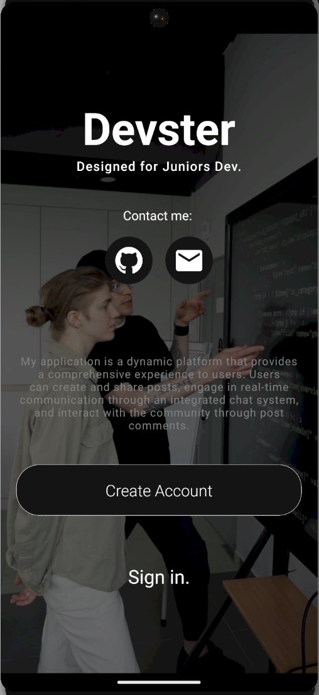
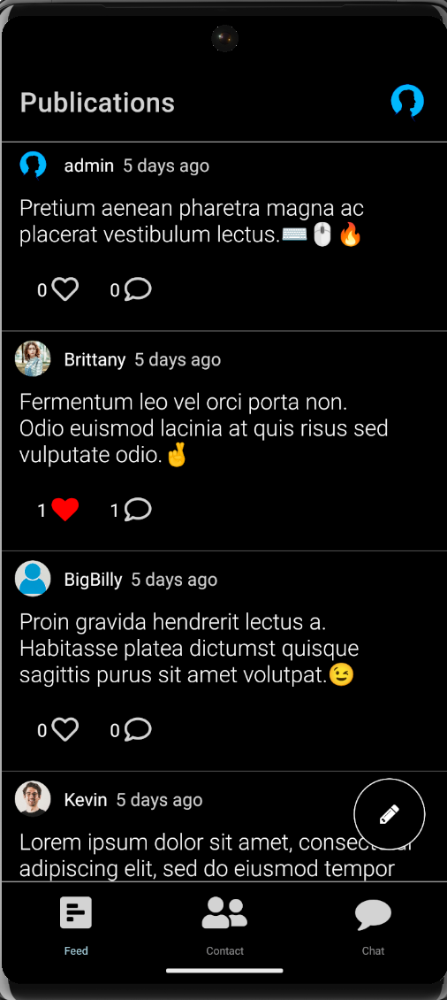

# Devster

Devster is a social mobile application developed in React Native with Expo, offering a friendly platform for developers to meet new developers, expand their community, and have the opportunity to make contacts.

This app is a school project currently under development, created as part of a learning process and intended for a portfolio.

## Features

- **Post Creation:** Users can create and publish posts.
  
- **Instant Messaging:** Ability to send private messages to other app users for real-time discussions.

## Screenshots

{:width="200px" height="100px"}
{:width="200px" height="100px"}

## Technologies Used

- Frontend: React Native, React Navigation (for app navigation)
  
- Backend: Firebase Firestore (NoSQL database), Firebase Authentication (for user authentication)

## Installation

1. Clone the repository: git clone https://github.com/NathDore/devster-react-native.git
2. Navigate to the project directory: cd devster-react-native
3. Install dependencies: npm install
4. Run the app: npx expo start

## Project Status

Active development is ongoing. Basic features are operational, and the project is open to new ideas and enhancements.

## Authors

- Nathaniel Dore - nathprogtravail@gmail.com
